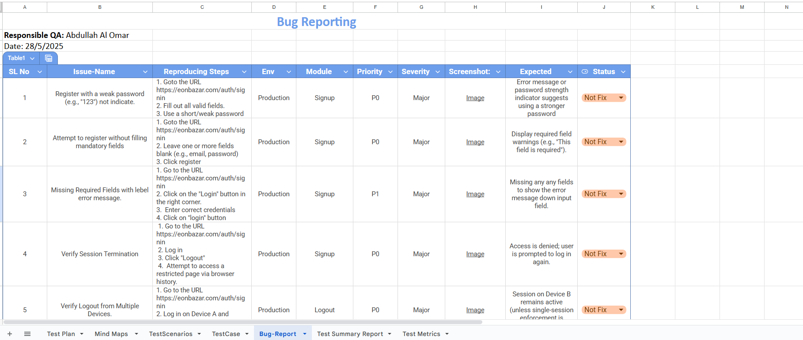
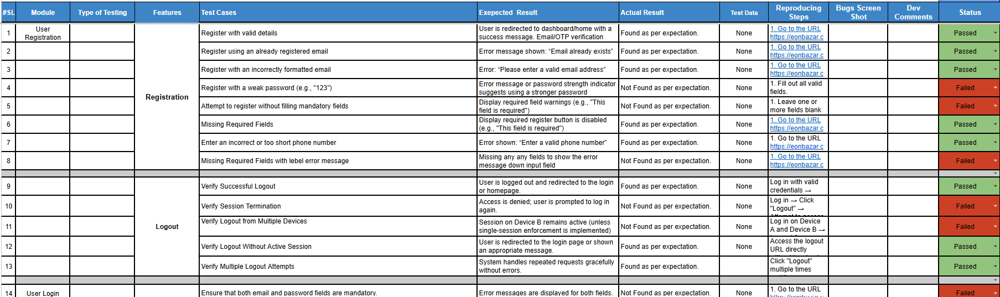
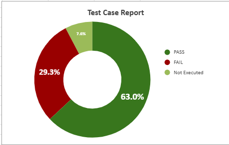
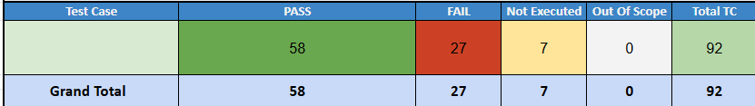
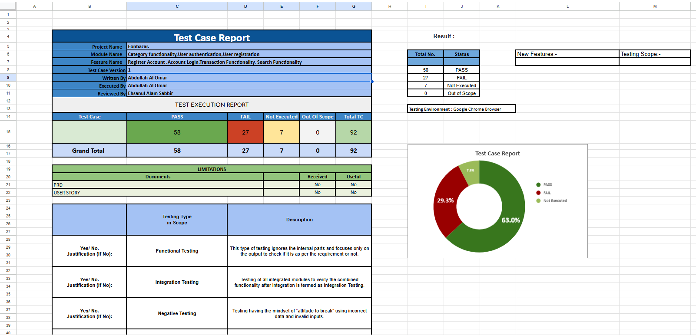
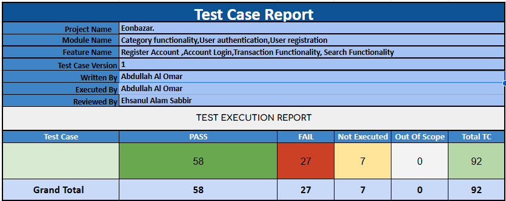
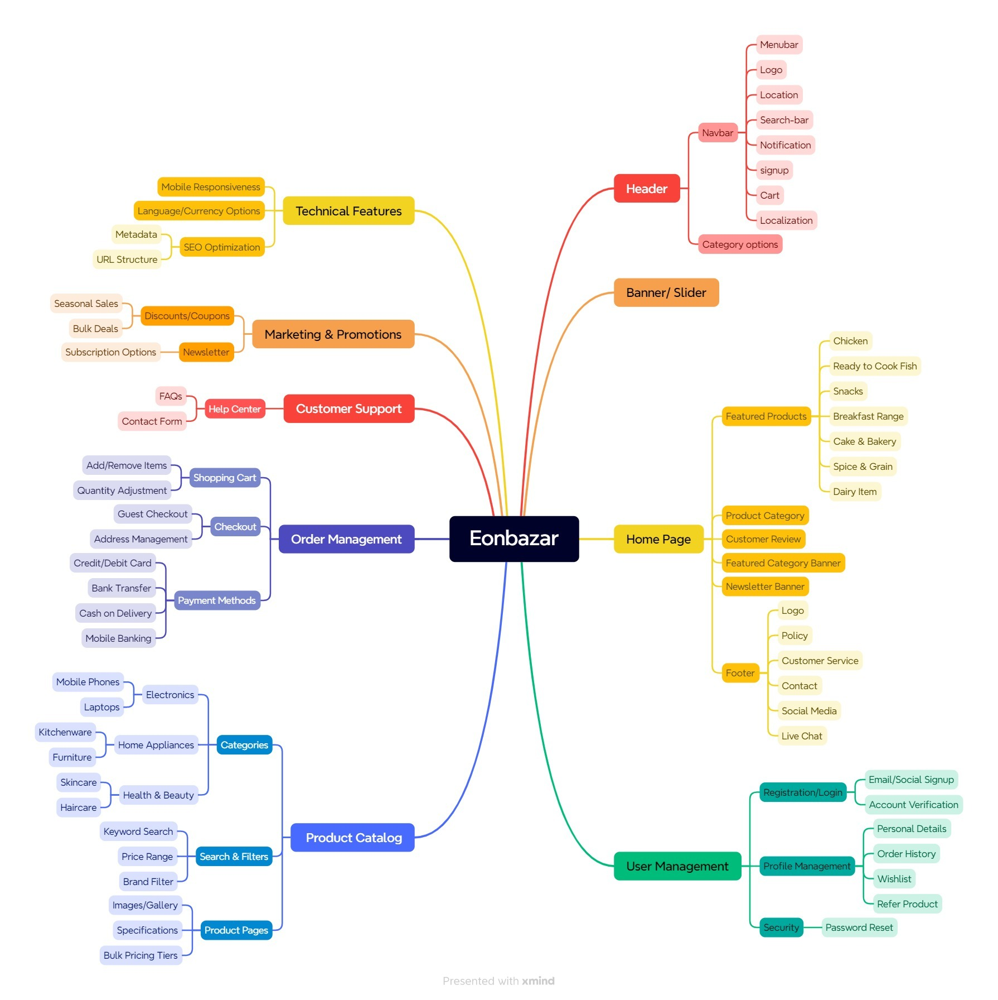
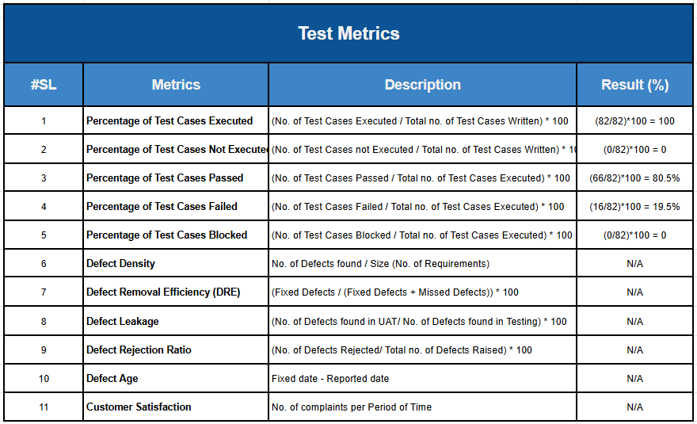
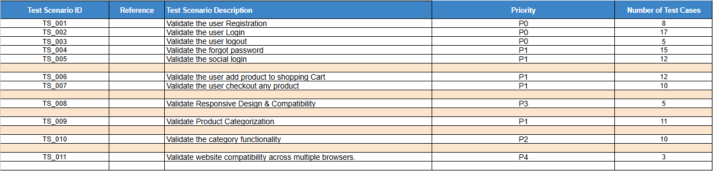

# 🧪 EonBazar Manual Testing Project — Bug Report

---

## Project Link: (https://docs.google.com/spreadsheets/d/1C6SQ2Yao0hX6OkdmoVMfV_nTvcmdgYg3/edit?gid=212710091#gid=212710091)

## 📘 Project Overview

The **EonBazar Manual Testing Project** is a structured Quality Assurance (QA) initiative focused on testing the **EonBazar e-commerce web application**.  
This project demonstrates manual testing techniques, including **test planning, scenario design, test case execution, bug identification, and bug reporting** using a systematic approach.

The aim of this project is to ensure that all functionalities of the EonBazar website — from browsing products to completing purchases — work as expected across different browsers and devices.

---

## 🛍️ About EonBazar

**EonBazar** is a dynamic online shopping platform where users can:
- Register and manage user accounts  
- Search, filter, and view products  
- Add items to the cart and wishlist  
- Complete purchases through a secure checkout  
- Track orders and view purchase history  
- Admins can manage users, products, and transactions  

The site emphasizes user-friendly navigation, clean UI, and secure transactions.

---

## 🎯 Testing Objectives

- Identify and document all **functional and UI bugs**  
- Validate **form fields, navigation, and workflows**  
- Ensure **responsiveness** across devices  
- Verify **cross-browser compatibility**  
- Test **data consistency** and **error handling**  
- Provide clear, reproducible **bug reports** for developers  

---

## 🧩 Scope of Testing

| Testing Type | Modules Covered |
|---------------|----------------|
| **Functional Testing** | Login, Signup, Product Search, Add to Cart, Checkout |
| **UI/UX Testing** | Layout, responsiveness, navigation |
| **Usability Testing** | Page flow, readability, user experience |
| **Validation Testing** | Input fields, form submission, error messages |
| **Regression Testing** | Retesting after bug fixes |

---

## 🧾 Deliverables

- ✅ Test Plan  
- ✅ Test Scenarios & Test Cases  
- ✅ Bug Reports (Excel / Word / Markdown)  
- ✅ Test Summary Report  
- ✅ Screenshots & Logs  

---

## 🧰 Tools Used

| Purpose | Tool |
|----------|------|
| Documentation | MS Word / Google Docs |
| Test Case Management | Excel Sheet |
| Bug Reporting | GitHub Issues / Excel |
| Screenshot Capture | Lightshot / Snagit |
| Browser Testing | Chrome, Firefox, Edge |

---

## 🐞 Bug Report Section

This section includes detailed bug reports identified during manual testing of the **EonBazar** website.

### Sample Bug Report (Markdown Format)

### Bug ID  
BUG-001

### Title  
Login button not responding

### Reported By  
Abdullah Al Omar

### Date  
2025-10-08

### Environment  
- Device: Desktop  
- OS: Windows 11  
- Browser: Chrome v118.0  
- Resolution: 1920×1080  

### Steps to Reproduce  
1. Open EonBazar website  
2. Navigate to the Login page  
3. Enter valid credentials  
4. Click the “Login” button  

### Actual Result  
Nothing happens — no redirection or error message displayed.  

### Expected Result  
User should be redirected to the dashboard after successful login.  

### Severity / Priority  
- Severity: Major  
- Priority: High  

### Screenshot  

